# Polyglot Codebase Knowledge Graph

> Generated offline by **readmenator**. Supports C, C++, Python, Go, Rust, JS/TS, Java, C#, Shell, PHP, Dart, GDScript, Nim, ASM, Ruby, Swift, Kotlin, Scala, Lua, Elixir.
> No LLMs. No tokens. Pure static analysis. See more [here](https://github.com/grisuno/ReadMenator)

**Total Files Parsed:** 3 | **Total Symbols Extracted:** 12 | **Total Imports:** 4

<!-- ranking_model: v1.0 | weights: {ppr:0.45,auth:0.2,test:0.15,doc:0.1,fresh:0.1} | alpha:0.85 | commit:75d209c | date:2026-07-18 -->


## Table of Contents

1. [Statistics Dashboard](#statistics-dashboard)
2. [Architectural Layers](#architectural-layers)
3. [Ranked Context](#ranked-context)
4. [God Nodes](#god-nodes)
5. [Suggested Questions](#suggested-questions)
6. [Hotspot Analysis](#hotspot-analysis)
7. [Change Impact Analysis](#change-impact-analysis)
8. [Suggested Linting Rules](#suggested-linting-rules)
9. [Orphans](#orphans)
10. [Query Recipes](#query-recipes)
11. [Structural Knowledge Map](#structural-knowledge-map)
12. [UML Class Diagram](#uml-class-diagram)
13. [Code Property Graph](#code-property-graph)
14. [Architecture Reference](#architecture-reference)
    - [PY (3 files)](#py-3-files)

---

## Statistics Dashboard

| Metric | Value |
|--------|-------|
| Total Files | 3 |
| Total Symbols | 12 |
| Total Imports | 4 |
| Call Edges | 33 |
| Inheritance Edges | 0 |
| Languages | 1 |
| Avg Symbols/File | 4.0 |
| Avg Imports/File | 1.3 |

### Top Files by Import Count (Fan-Out)

| File | Imports | Symbols | Language |
|------|---------|---------|----------|
| `main.py` | 2 | 3 | py |
| `main2.py` | 1 | 3 | py |
| `main3.py` | 1 | 6 | py |

---

## Architectural Layers

Auto-detected from path patterns, naming conventions, and imported frameworks.

| Layer | Files |
|-------|-------|
| utility | 3 |

### utility

- `main.py` (py, 3 symbols)
- `main2.py` (py, 3 symbols)
- `main3.py` (py, 6 symbols)

---

## Ranked Context

Files ranked by composite score for the current query context. The ranking combines Personalized PageRank (query relevance), global authority, test coverage, documentation coverage, and code freshness. Model: v1.0.

| Rank | File | Composite | PPR | Authority | Test | Doc |
|------|------|-----------|-----|-----------|------|-----|
| 1 | `main.py` | 0.0000 | 0.0000 | 0.0000 | 0.00 | 0.00 |
| 2 | `main2.py` | 0.0000 | 0.0000 | 0.0000 | 0.00 | 0.00 |
| 3 | `main3.py` | 0.0000 | 0.0000 | 0.0000 | 0.00 | 0.00 |

---

## God Nodes

Most architecturally central files ranked by combined import/export degree and symbol richness.

| File | Score | Connections | PageRank |
|------|-------|-------------|----------|
| `main3.py` | 0.6 | | 0.0000 |
| `main.py` | 0.3 | | 0.0000 |
| `main2.py` | 0.3 | | 0.0000 |

---

## Suggested Questions

Auto-generated exploration prompts based on graph structure:

- What does main3.py depend on, and what depends on it? (0 connections)
- What does main.py depend on, and what depends on it? (0 connections)
- What does main2.py depend on, and what depends on it? (0 connections)
- What is the overall architecture of this codebase?

---

## Hotspot Analysis

Files ranked by combined complexity (symbol count) and centrality (connection count). High-scoring files are architecturally critical and may need refactoring attention.

| File | Complexity | Centrality | Combined | Symbols | Connections |
|------|-----------|------------|----------|---------|-------------|
| `main.py` | 0.500 | 1.000 | 0.800 | 3 | 2 |
| `main2.py` | 0.500 | 0.500 | 0.500 | 3 | 1 |
| `main3.py` | 1.000 | 0.500 | 0.700 | 6 | 1 |

---

## Change Impact Analysis

Files sorted by how many other files would be affected if they changed. High-impact files should be changed with caution.

| File | Direct Dependents | Transitive Dependents | Total Impact |
|------|------------------|----------------------|--------------|
| `main.py` | 0 | 0 | 0 |
| `main2.py` | 0 | 0 | 0 |
| `main3.py` | 0 | 0 | 0 |

---

## Suggested Linting Rules

Automatically suggested linting and security rules based on patterns detected in the codebase. These can be exported as Semgrep rules using the `--export-rules` flag.

| Rule ID | Severity | Description | Language | Matches |
|---------|----------|-------------|----------|---------|
| `RM001` | info | Large number of functions in py: 12 total | py | 12 |
| `RM002` | info | Print statement found (consider logging instead) | python | 11 |

---

## Orphans

Files with no documentation or low connectivity. These are candidates for documentation investment or cleanup.

- `main.py` (3 symbols, no doc)
- `main2.py` (3 symbols, no doc)
- `main3.py` (6 symbols, no doc)

---

## Query Recipes

Example queries you can run against this knowledge base using the ranking engine:

```
# Find files most relevant to a concept
readmenator query "Where is the import resolver implemented?"

# Rank files by relevance to a topic
readmenator query "How does documentation generation work?"

# Explain why a file ranks highly
readmenator query "explain readmenator/_documentation.py"

# Trace dependency paths with ranked context
readmenator query "path from CLI to exporter"
```

The ranking model uses the following signals:

- **Personalized PageRank** (45% weight): query-specific relevance via seed propagation
- **Global Authority** (20% weight): structural importance via standard PageRank
- **Test Coverage** (15% weight): fraction of symbols referenced in test files
- **Doc Coverage** (10% weight): presence of docstrings and file-level docs
- **Freshness** (10% weight): recent modification activity

Results include score decomposition and justification paths for each ranked item.

---

## Structural Knowledge Map

```mermaid
graph TD
    classDef mod fill:#1e1e1e,stroke:#ff6666,stroke-width:2px,color:#fff;
    classDef cls fill:#2d2d2d,stroke:#4ec9b0,stroke-width:2px,color:#fff;
    classDef fn fill:#333,stroke:#dcdcaa,stroke-width:1px,color:#dcdcaa;
    classDef ext fill:#111,stroke:#666,stroke-dasharray:5 5,color:#aaa;
    main_py["main.py (py)"]
    class main_py mod;
    main_py_base4_to_binary["base4_to_binary"]
    class main_py_base4_to_binary fn;
    main_py --> main_py_base4_to_binary
    main_py_base4_to_dna["base4_to_dna"]
    class main_py_base4_to_dna fn;
    main_py --> main_py_base4_to_dna
    main_py_plot_dna["plot_dna"]
    class main_py_plot_dna fn;
    main_py --> main_py_plot_dna
    main3_py["main3.py (py)"]
    class main3_py mod;
    main3_py_traducir_adn_a_colores["traducir_adn_a_colores"]
    class main3_py_traducir_adn_a_colores fn;
    main3_py --> main3_py_traducir_adn_a_colores
    main3_py_obtener_numero_base_4["obtener_numero_base_4"]
    class main3_py_obtener_numero_base_4 fn;
    main3_py --> main3_py_obtener_numero_base_4
    main3_py_crear_gif_adn["crear_gif_adn"]
    class main3_py_crear_gif_adn fn;
    main3_py --> main3_py_crear_gif_adn
    main3_py_adn_a_binario["adn_a_binario"]
    class main3_py_adn_a_binario fn;
    main3_py --> main3_py_adn_a_binario
    main3_py_adn_a_codigo_maquina["adn_a_codigo_maquina"]
    class main3_py_adn_a_codigo_maquina fn;
    main3_py --> main3_py_adn_a_codigo_maquina
    main2_py["main2.py (py)"]
    class main2_py mod;
    ext_matplotlib_pyplot["matplotlib.pyplot"]
    class ext_matplotlib_pyplot ext;
    main_py -.->|imports| ext_matplotlib_pyplot
    ext_pandas["pandas"]
    class ext_pandas ext;
    main_py -.->|imports| ext_pandas
    ext_ctypes["ctypes"]
    class ext_ctypes ext;
    main2_py -.->|imports| ext_ctypes
    ext_PIL["PIL"]
    class ext_PIL ext;
    main3_py -.->|imports| ext_PIL
```



---

## Code Property Graph

Machine-readable Code Property Graph (CPG) in JSON-LD format. This block allows AI agents to parse the full structural graph without additional file reads. Compatible with GraphRAG pipelines.

```json
{"@context": "https://schema.org", "analysis": {"communities": [], "god_nodes": [{"node_id": "main3.py", "score": 0.6}, {"node_id": "main.py", "score": 0.3}, {"node_id": "main2.py", "score": 0.3}], "surprising_connections": []}, "edges": [{"confidence": "EXTRACTED", "relation": "imports", "source": "main.py", "target": "matplotlib.pyplot"}, {"confidence": "EXTRACTED", "relation": "imports", "source": "main.py", "target": "pandas"}, {"confidence": "EXTRACTED", "relation": "imports", "source": "main2.py", "target": "ctypes"}, {"confidence": "EXTRACTED", "relation": "imports", "source": "main3.py", "target": "PIL"}], "generator": "readmenator", "metadata": {"edge_count": 37, "file_count": 3, "language_count": 1, "symbol_count": 12}, "nodes": [{"id": "main.py", "kind": "module", "label": "main.py", "language": "py", "sha256": "9a07768e33e7842b", "symbol_count": 3, "symbols": [{"kind": "function", "line": 4, "name": "base4_to_binary", "signature": "def base4_to_binary(base4_string)"}, {"kind": "function", "line": 11, "name": "base4_to_dna", "signature": "def base4_to_dna(base4_string)"}, {"kind": "function", "line": 18, "name": "plot_dna", "signature": "def plot_dna(dna_string)"}]}, {"id": "main2.py", "kind": "module", "label": "main2.py", "language": "py", "sha256": "97b5b26d1cf62bc7", "symbol_count": 3, "symbols": [{"kind": "function", "line": 3, "name": "codificar_adn", "signature": "def codificar_adn(secuencia)"}, {"kind": "function", "line": 23, "name": "base4_a_binario", "signature": "def base4_a_binario(numero)"}, {"kind": "function", "line": 26, "name": "binario_a_codigo_maquina", "signature": "def binario_a_codigo_maquina(numero)"}]}, {"id": "main3.py", "kind": "module", "label": "main3.py", "language": "py", "sha256": "74852ef76bc1f6d0", "symbol_count": 6, "symbols": [{"kind": "function", "line": 2, "name": "traducir_adn_a_colores", "signature": "def traducir_adn_a_colores(cadena_adn)"}, {"kind": "function", "line": 15, "name": "obtener_numero_base_4", "signature": "def obtener_numero_base_4(cadena_adn)"}, {"kind": "function", "line": 30, "name": "crear_gif_adn", "signature": "def crear_gif_adn(cadena_adn, colores)"}, {"kind": "function", "line": 50, "name": "adn_a_binario", "signature": "def adn_a_binario(cadena_adn)"}, {"kind": "function", "line": 60, "name": "adn_a_codigo_maquina", "signature": "def adn_a_codigo_maquina(cadena_adn)"}, {"kind": "function", "line": 71, "name": "mostrar_resultados", "signature": "def mostrar_resultados(cadena_adn)"}]}], "type": "CodePropertyGraph", "version": "1.0"}
```

---

## Architecture Reference

### PY (3 files)

#### `main.py`
**Path:** `main.py`

**Functions:**
- `base4_to_binary` (line 4) `def base4_to_binary(base4_string)`
- `base4_to_dna` (line 11) `def base4_to_dna(base4_string)`
- `plot_dna` (line 18) `def plot_dna(dna_string)`

#### `main2.py`
**Path:** `main2.py`

**Functions:**
- `codificar_adn` (line 3) `def codificar_adn(secuencia)`
- `base4_a_binario` (line 23) `def base4_a_binario(numero)`
- `binario_a_codigo_maquina` (line 26) `def binario_a_codigo_maquina(numero)`

#### `main3.py`
**Path:** `main3.py`

**Functions:**
- `traducir_adn_a_colores` (line 2) `def traducir_adn_a_colores(cadena_adn)`
- `obtener_numero_base_4` (line 15) `def obtener_numero_base_4(cadena_adn)`
- `crear_gif_adn` (line 30) `def crear_gif_adn(cadena_adn, colores)`
- `adn_a_binario` (line 50) `def adn_a_binario(cadena_adn)`
- `adn_a_codigo_maquina` (line 60) `def adn_a_codigo_maquina(cadena_adn)`
- `mostrar_resultados` (line 71) `def mostrar_resultados(cadena_adn)`
