# Polyglot Codebase Knowledge Graph

> Generated offline by **readmenator**. Supports C, C++, Python, Go, Rust, JS/TS, Java, C#, Shell, PHP, Dart, GDScript, Nim, ASM.
> No LLMs. No tokens. Pure static analysis. See more [here](https://github.com/grisuno/ReadMenator)

**Total Files Parsed:** 3 | **Total Symbols Extracted:** 12 | **Total Imports:** 4

## Structural Knowledge Map

```mermaid
graph TD
    classDef mod fill:#1e1e1e,stroke:#ff6666,stroke-width:2px,color:#fff;
    classDef cls fill:#2d2d2d,stroke:#4ec9b0,stroke-width:2px,color:#fff;
    classDef fn fill:#333,stroke:#dcdcaa,stroke-width:1px,color:#dcdcaa;
    classDef ext fill:#111,stroke:#666,stroke-dasharray:5 5,color:#aaa;
    main_py["main.py (py)"]
    class main_py mod;
    main_py_base4_to_binary["base4_to_binary"]
    class main_py_base4_to_binary fn;
    main_py --> main_py_base4_to_binary
    main_py_base4_to_dna["base4_to_dna"]
    class main_py_base4_to_dna fn;
    main_py --> main_py_base4_to_dna
    main_py_plot_dna["plot_dna"]
    class main_py_plot_dna fn;
    main_py --> main_py_plot_dna
    main3_py["main3.py (py)"]
    class main3_py mod;
    main3_py_traducir_adn_a_colores["traducir_adn_a_colores"]
    class main3_py_traducir_adn_a_colores fn;
    main3_py --> main3_py_traducir_adn_a_colores
    main3_py_obtener_numero_base_4["obtener_numero_base_4"]
    class main3_py_obtener_numero_base_4 fn;
    main3_py --> main3_py_obtener_numero_base_4
    main3_py_crear_gif_adn["crear_gif_adn"]
    class main3_py_crear_gif_adn fn;
    main3_py --> main3_py_crear_gif_adn
    main3_py_adn_a_binario["adn_a_binario"]
    class main3_py_adn_a_binario fn;
    main3_py --> main3_py_adn_a_binario
    main3_py_adn_a_codigo_maquina["adn_a_codigo_maquina"]
    class main3_py_adn_a_codigo_maquina fn;
    main3_py --> main3_py_adn_a_codigo_maquina
    main2_py["main2.py (py)"]
    class main2_py mod;
    main2_py_codificar_adn["codificar_adn"]
    class main2_py_codificar_adn fn;
    main2_py --> main2_py_codificar_adn
    main2_py_base4_a_binario["base4_a_binario"]
    class main2_py_base4_a_binario fn;
    main2_py --> main2_py_base4_a_binario
    main2_py_binario_a_codigo_maquina["binario_a_codigo_maquina"]
    class main2_py_binario_a_codigo_maquina fn;
    main2_py --> main2_py_binario_a_codigo_maquina
    ext_matplotlib_pyplot["matplotlib.pyplot"]
    class ext_matplotlib_pyplot ext;
    main_py -.->|imports| ext_matplotlib_pyplot
    ext_pandas["pandas"]
    class ext_pandas ext;
    main_py -.->|imports| ext_pandas
    ext_ctypes["ctypes"]
    class ext_ctypes ext;
    main2_py -.->|imports| ext_ctypes
    ext_PIL["PIL"]
    class ext_PIL ext;
    main3_py -.->|imports| ext_PIL
```

---

## Architecture Reference

### PY (3 files)

#### `main.py`
**Path:** `main.py`

**Functions:**
- `base4_to_binary` (line 4) `def base4_to_binary(base4_string)`
- `base4_to_dna` (line 11) `def base4_to_dna(base4_string)`
- `plot_dna` (line 18) `def plot_dna(dna_string)`

#### `main2.py`
**Path:** `main2.py`

**Functions:**
- `codificar_adn` (line 3) `def codificar_adn(secuencia)`
- `base4_a_binario` (line 23) `def base4_a_binario(numero)`
- `binario_a_codigo_maquina` (line 26) `def binario_a_codigo_maquina(numero)`

#### `main3.py`
**Path:** `main3.py`

**Functions:**
- `traducir_adn_a_colores` (line 2) `def traducir_adn_a_colores(cadena_adn)`
- `obtener_numero_base_4` (line 15) `def obtener_numero_base_4(cadena_adn)`
- `crear_gif_adn` (line 30) `def crear_gif_adn(cadena_adn, colores)`
- `adn_a_binario` (line 50) `def adn_a_binario(cadena_adn)`
- `adn_a_codigo_maquina` (line 60) `def adn_a_codigo_maquina(cadena_adn)`
- `mostrar_resultados` (line 71) `def mostrar_resultados(cadena_adn)`
